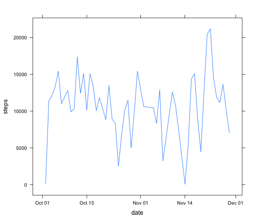
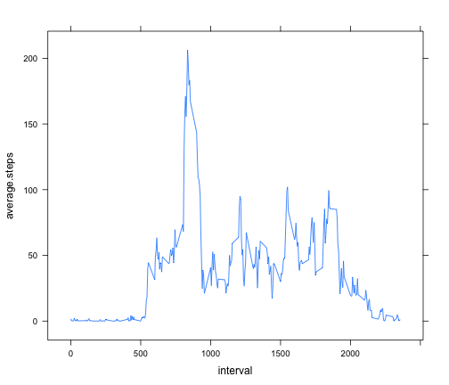
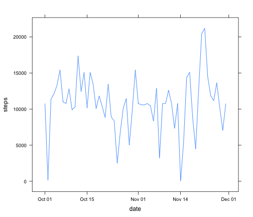
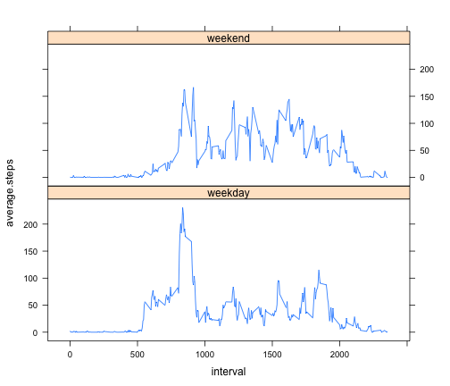

Reproducible Data Analysis (Project 1)
========================================================

**Defining Functions To:**
- Compute mean per five minutes interval
- Compute steps taken per day


```r
library(lattice)

# ------------------------------------------------------------ #
# Function to calculate and return the mean steps per 5-minutes interval
# ------------------------------------------------------------ #
computeMeanPerFiveMinuteInterval <- function(input.data) {
  steps.per.interval      <- split(input.data$steps, input.data$interval)
  num.rows                <- length(steps.per.interval)
  steps.per.interval.data <- data.frame(interval = rep("", num.rows), average.steps = rep("", num.rows), stringsAsFactors = FALSE)
  for(name in names(steps.per.interval)) {
    steps <- steps.per.interval[[name]]
    steps <- steps[!is.na(steps)]
    steps <- as.numeric(steps)
    new.row <- c(name, mean(steps))
    steps.per.interval.data <- rbind(steps.per.interval.data, new.row)
  }
  steps.per.interval.data$interval      <- as.numeric(steps.per.interval.data$interval)
  steps.per.interval.data$average.steps <- as.numeric(steps.per.interval.data$average.steps)
  steps.per.interval.data               <- steps.per.interval.data[complete.cases(steps.per.interval.data), ]
  steps.per.interval.data
}

# ------------------------------------------------------------ #
# Function to calculate and return the total steps per day
# ------------------------------------------------------------ #
computeStepsPerDay <- function(input.data) {
  sum.vector      <- sapply(split(input.data$steps, input.data$date), sum)
  num.rows        <- length(sum.vector)
  sum.input.data  <- data.frame(date = rep("", num.rows), steps = rep("", num.rows), stringsAsFactors = FALSE)
  for(date in names(sum.vector)) {
    new.row <- c(date, sum.vector[[date]])
    sum.input.data <- rbind(sum.input.data, new.row)
  }
  sum.input.data$date   <- as.POSIXct(sum.input.data$date, format = "%Y-%m-%d")
  sum.input.data$steps  <- as.numeric(sum.input.data$steps)
  sum.input.data        <- sum.input.data[complete.cases(sum.input.data), ]
  
  steps.vector <- sum.input.data$steps
  steps.vector <- steps.vector[!is.na(steps.vector)]

  print(paste("mean [", mean(steps.vector), "], median [", median(steps.vector), "]", sep = ""))
  sum.input.data
}
```

**Load and Preprocess the Data**

```r
# ------------------------------------------------------------ #
# Load the activity data into the data frame
# ------------------------------------------------------------ #
activity.data <- read.csv("activity.csv")

names(activity.data) <- c("steps", "date", "interval")
activity.data$date   <- as.POSIXct(activity.data$date, format = "%Y-%m-%d")
activity.data$steps  <- as.numeric(activity.data$steps)

# ------------------------------------------------------------ #
# Calculate and display the total steps per day
# ------------------------------------------------------------ #
steps.per.day <- computeStepsPerDay(activity.data)
```

```
## [1] "mean [10766.1886792453], median [10765]"
```

**Plot - Steps Taken Per Day**

```r
xyplot(steps ~ date, data = steps.per.day, type = "l")
```

 

**Average Daily Activity Pattern**

```r
# ------------------------------------------------------------ #
# Calculate and display the mean steps per 5-minutes interval
# ------------------------------------------------------------ #
mean.per.five.minute <- computeMeanPerFiveMinuteInterval(activity.data)
xyplot(average.steps ~ interval, data = mean.per.five.minute, type = "l")
```

 


```r
interval.with.max.average.steps <- mean.per.five.minute$interval[mean.per.five.minute$average.steps == max(mean.per.five.minute$average.steps)]
print(paste("time interval with maximum average steps [", interval.with.max.average.steps, "]", sep = ""))
```

```
## [1] "time interval with maximum average steps [835]"
```

**Input Missing Data**
*[The missing NA data is replaced by the overall average value for that interval]*

```r
# ------------------------------------------------------------ #
# Fill in the missing NA data to the original data frame
# ------------------------------------------------------------ #
num.rows <- nrow(activity.data)
na.count <- 0
for(index in 1:num.rows) {
  if(is.na(activity.data$steps[index])) {
    na.count                    <- na.count + 1
    missing.activity.data       <- mean.per.five.minute$average.steps[mean.per.five.minute$interval == activity.data$interval[index]]
    activity.data$steps[index]  <- missing.activity.data
  }
}
print(paste("total NA in original data [", na.count, "]", sep = ""))
```

```
## [1] "total NA in original data [2304]"
```

**Calculate and Display the Total Steps Per Day with New Data**

```r
# ------------------------------------------------------------ #
# Calculate and display the total steps per day with new data
# ------------------------------------------------------------ #
steps.per.day <- computeStepsPerDay(activity.data)
```

```
## [1] "mean [10766.1886792453], median [10766.1886792453]"
```

```r
xyplot(steps ~ date, data = steps.per.day, type = "l")
```

 

**Display Average Steps Data for Weekday vs Weekend**

```r
# ------------------------------------------------------------ #
# Add a new column, day.type to activity data frame
# ------------------------------------------------------------ #
activity.data$day.type <- apply(activity.data, 1, function(row) if(weekdays(as.Date(row[2])) %in% c("Saturday", "Sunday")) "weekend" else "weekday")
steps.data.by.day.type  <- split(activity.data[1:3], activity.data$day.type)

mean.per.five.minute.weekday <- computeMeanPerFiveMinuteInterval(steps.data.by.day.type$weekday)
mean.per.five.minute.weekend <- computeMeanPerFiveMinuteInterval(steps.data.by.day.type$weekend)

# ------------------------------------------------------------ #
# Create a new data frame with "day type" => ('weekday', 'weekend')
# ------------------------------------------------------------ #
num.rows                    <- nrow(mean.per.five.minute.weekday)
combined.data.for.all.days  <- data.frame(interval = rep("", num.rows*2), average.steps = rep("", num.rows*2), day.type = rep("", num.rows*2), stringsAsFactors = FALSE)
for(index in 1:num.rows) {
  new.row.weekday             <- c(mean.per.five.minute.weekday$interval[index], mean.per.five.minute.weekday$average.steps[index], "weekday");
  combined.data.for.all.days  <- rbind(combined.data.for.all.days, new.row.weekday)
  new.row.weekend             <- c(mean.per.five.minute.weekend$interval[index], mean.per.five.minute.weekend$average.steps[index], "weekend");
  combined.data.for.all.days  <- rbind(combined.data.for.all.days, new.row.weekend)
}
combined.data.for.all.days$interval       <- as.numeric(combined.data.for.all.days$interval)
combined.data.for.all.days$average.steps  <- as.numeric(combined.data.for.all.days$average.steps)
combined.data.for.all.days                <- combined.data.for.all.days[complete.cases(combined.data.for.all.days), ]

xyplot(average.steps ~ interval | factor(day.type), data = combined.data.for.all.days, type = "l", layout = c(1, 2))
```

 
